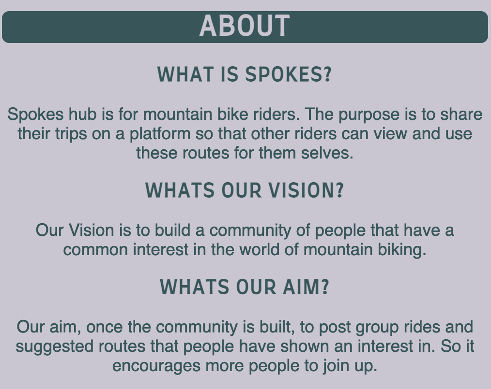
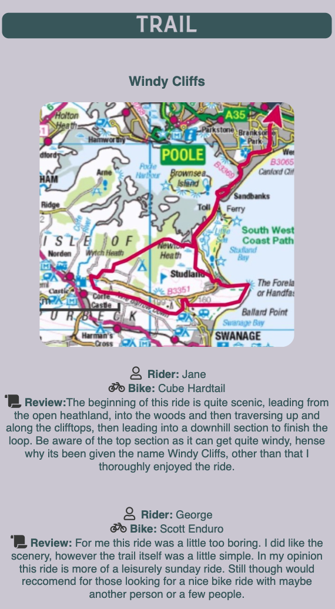
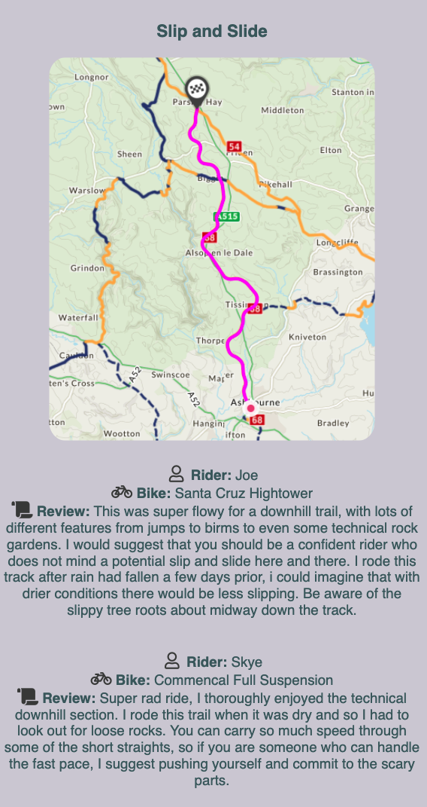

# Spokes

Spokes is a website designed to help Mountain Bikers build a community where social interaction is encouraged. Whether that is sharing trails on the website or even creating and sharing a local meet up and rides through social media links. Mountain bikers know that you can ride alone, however they all know that riding with friends or even a community of like minded people is what makes the ride even more exciting. 

Spokes hopes to bring that to life. through either the trail sharing page, where riders can share their rides. Or through the social networks where riders can post messages or locations of local rides that people can attend.

## Features

__Logo and Navigation__

* This image shows the Main title of the website.
* This also includes thenavigation bar. Which allows the user to skip down to the different sections of the website with a click of the button.

__Back to Top Button__

* On the side of the page on the bottom right hand corner is a style back to the top button.
* This button has also been styled to have a smooth scroll, for improved user design.

__Main Image__

* The main image is to show the main theme for this website, all about biking and the outdoors.

__About__

* This section shows the user what the purpose of spokes is about, its vision and the aim of the website.

__Trail__

* This section provides members input. As you can see the two posts that are shown are testimonials from members who wish to share their experiences on the different trails.
* The trail section will expand over time as more members sign up and input their experiences and testimonials to the page.

* __Hub__
    * This section is for users to imput personal details to sign up to be a member.
    * This allows them to add to the abover trail section and to be part of a gowing community.

* __Footer__
    * Decided to keep the footer section short and simple and it shows that spokes is connected to other social media pages. From Instagram to Twitter.
    * The user can click and connect up to the different social media pages to either see photos on instagram either from posts from Spokes or from tags that users have posted on their uploads. Twitter will be used to send out potential rides that maybe local to the user. Depending on location.

## Features to Add

### Image Carousel

* I would like to implement an image carousel on the main image section, using members images. The reason for this not being at the initial launch is due to not having members signed up to the website, but will be updated as members start to join.

### Members Page

* To create a members page I need to create a back end server to store data so that users can become mmembers and add to the website.
* Once logged into the social page it will allow members to input and add their trails to the main trail section part of the website.

## Testing

* __HTML__
    * No errors were found when i used the official [W3C validator](https://validator.w3.org/nu/?showsource=yes&doc=https%3A%2F%2Fmbissett29.github.io%2FSpokes%2F)

*__CSS__
    * No errors were found when i used the official [(Jigsaw) validator](https://jigsaw.w3.org/css-validator/validator?uri=https%3A%2F%2Fvalidator.w3.org%2Fnu%2F%3Fshowsource%3Dyes%26doc%3Dhttps%253A%252F%252Fmbissett29.github.io%252FSpokes%252F&profile=css3svg&usermedium=all&warning=1&vextwarning=&lang=en)

## Credits

* Instructions on how to implement a grid structure to my HTML and style using CSS was taken from [W3-Schools](https://www.w3schools.com/css/css_grid.asp)

* The icons in the headings and footer were taken from [Font Awesome](https://fontawesome.com/)

* The floating button was courtesy of learning from a youtube instructional video. [Floating-Button](https://www.youtube.com/watch?v=u5hx_YtqylA)

### Media 

* The only image that was used from a website was the the main image and that was taken from [Pexels](https://www.pexels.com/photo/biker-holding-mountain-bike-on-top-of-mountain-with-green-grass-161172/) this was a copyright free image site.

* the other images were taken from self sourced material that I have used.

### Deploymant

* Git Hub Deployment
    * Log into Git Hub.
    * Locate Spokes repository.
    * Click settings above in options bar.
    * Click to pages on the side bar
    * Under the source tab click none and select Main branch.
    * Click Save
    * A message about with say " Your site is ready to be published at (https://mbissett29.github.io/Spokes/) 
